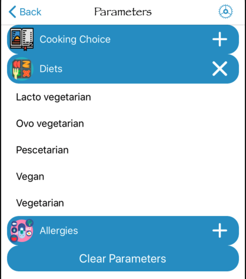
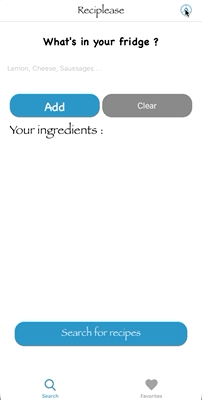
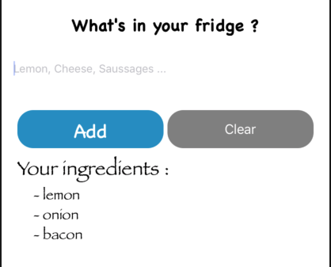
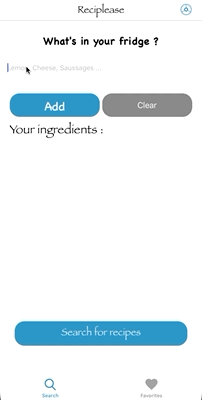
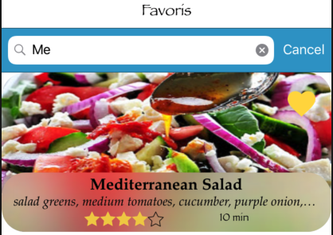
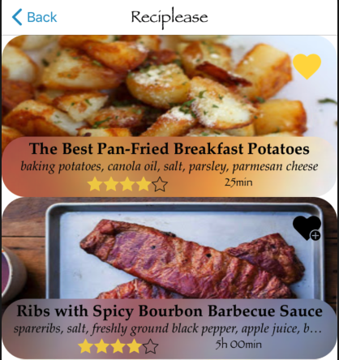

#  Projet 10
## Les Bonus de Reciplease
### L'application Reciplease
Reciplease est une application de recherches de recettes de cuisine avec des outils indispensables pour chercher par ingrédients et mettre ces recettes en favoris.

**l'application se compose de plusieurs fonctionnalités principales :**
* le choix des ingrédients pour trouver des recettes correspondantes
* l'affichage du résultat des recherches
* la visualisation d'une recette précise
* la mise en favori des recettes choisis
* la visualisation des recettes mises en favori
* la persistance de données pour les favoris
### Les Bonus
**Plusieurs fonctionnalités bonus ont été rajoutées à l'application Reciplease :**

> 1. Le choix de paramètres pour la recherche de recettes
> 2. La persistance de données pour les paramètres
> 3. La suppression des ingrédients un par un
> 4. La recherche parmi les favoris d'une recette spécifique
> 5. La possibilité de mettre une recette en favori directement sur la page des résultats de la recherche

### Implémentation des Bonus

>> 1.  Le choix de paramètres pour la recherche de recettes

Afin de permettre l'ajout de paramètres pour la recherche de recettes tel que les régimes alimentaires, un type de cuisine ou signaler des allergies, nous allons créer un tableau en deux dimensions, afin de repérer chaque type de paramètres avec sa liste de choix possibles.



Pour créer ce tableau nous allons commencer par créer une structure *Parameter* qui aura plusieurs propriétés :
* Une constante de type *String* appelée : **title** qui représentera le titre de la catégorie de paramètre
* Une variable de type *Bool* appelée : **isExpanded** qui permettra d'afficher/masquer le contenu de la catégorie dans la tableView
* une variable de type *ListElement* appelée : **list** qui renverra à une *struct* elle même composée de deux variables, name et isSelected
```
    struct Parameter {
        var isExpanded: Bool
        let title: String
        var list: [ListElement]
    }
    struct ListElement {
        var name: String
        var isSelected: Bool
    }
```
Nous pouvons donc ainsi créer un tableau de type *Parameter* appelé **twoDimensionalArray**

````var twoDimensionalArray = [Parameter]()````

Ce tableau va nous permettre de séparer les différentes sections de paramètres de notre tableView
La variable **isExpanded** nous servira pour afficher ou masquer la liste de paramètres proposés dans chaque catégorie

> Voici une animation présentant ce bonus.



>> 2. La persistance de données pour les paramètres

Les paramètres choisis par l'utilisateur seront gérés par le biais de méthodes en utilisant **User Default** pour la persistance de données grâce à trois variables static correspondant aux trois catégories :
````
static var cookingParameters : [String] {
    get {
        guard let cooking = UserDefaults.standard.object(forKey: Keys.cookingParameters) as? [String] else {
            return []
        }
        return cooking
    }
    set {
        UserDefaults.standard.set(newValue, forKey: Keys.cookingParameters)
    }
}

static var dietsParameters : [String] {
    get {
        guard let diets = UserDefaults.standard.object(forKey: Keys.dietsParameters) as? [String] else {
            return []
        }
        return diets
    }
    set {
        UserDefaults.standard.set(newValue, forKey: Keys.dietsParameters)
    }
}

static var alergiesParameters : [String] {
    get {
        guard let alergies = UserDefaults.standard.object(forKey: Keys.alergiesParameters) as? [String] else {
            return []
        }
        return alergies
    }
    set {
        UserDefaults.standard.set(newValue, forKey: Keys.alergiesParameters)
    }
}
````
Ensuite une méthode va permettre de supprimer les paramètres précédemment enregistrés pour revenir à zéro comme vu sur l'animation précédente.
````
func clearParameters() {
    ParametersRecording.cookingParameters.removeAll()
    ParametersRecording.dietsParameters.removeAll()
    ParametersRecording.alergiesParameters.removeAll()
}
````
> >3. La suppression des ingrédients un par un

La suppression des ingrédients se fait de manière globale grâce au bouton **Clear**, mais peut aussi se faire ingrédient par ingrédient
grâce à une méthode du protocole  **UITableViewDelegate** :



````
func tableView(_ tableView: UITableView, commit editingStyle: UITableViewCell.EditingStyle, forRowAt indexPath: IndexPath) {
    if editingStyle == .delete {
        ingredientService.removeIngredient(at: indexPath.row)
        tableView.deleteRows(at: [indexPath], with: .automatic)
    }
}
````
> Voici une animation présentant ce bonus.



>> 4. La recherche parmi les favoris d'une recette spécifique

Afin de permettre de trouver une recette parmi les favoris plus facilement, l'utilisateur pourra sur la liste de favoris utiliser une searchBar pour chercher une recette grâce au nom d'une recette.



pour ce bonus nous utiliserons une méthode du protocole **UISearchBarDelegate** :
````
func searchBar(_ searchBar: UISearchBar, textDidChange searchText: String) {
    if searchText == "" {
        favoriteRecipe = FavoriteRecipe.all
        recipeListTableView.reloadData()
    } else {
        favoriteRecipe = FavoriteRecipe.fetch(searchText)
        recipeListTableView.reloadData()
    }
}
````
Cette méthode va renvoyer vers la méthode *fetch* de notre class **FavoriteRecipe** qui va filtrer les données stockées dans coreData pour ne garder que les données correspondant à la recherche searchBar de l'utilisateur.
````
static func fetch(_ name: String) -> [FavoriteRecipe] {
    let request: NSFetchRequest<FavoriteRecipe> = FavoriteRecipe.fetchRequest()
    request.predicate = NSPredicate(format: "name CONTAINS[cd] %@", name)
    request.sortDescriptors = [NSSortDescriptor(key: "name", ascending: true)]
    guard let recipe = try? AppDelegate.viewContext.fetch(request) else { return [] }
    return recipe
}
````

> Voici une animation présentant ce bonus.


>> 5. La possibilité de mettre une recette en favori directement sur la page des résultats de la recherche

Ce bonus va permettre à l'utilisateur d'ajouter ou de supprimer une recette des favoris directement sur la page présentant le résultat de la recherche de recettes par ingrédients.



Pour gérer ce bonus, nous allons utiliser une méthode pour définir si la recette fait déjà ou non parti des favoris et le cas échéant ajouter la recette sélectionnée à notre objet FavoriteRecipe sauvegardé avec "*CoreData*" ou la supprimer.
````
func addRemoveFavorite(_ cell: UITableViewCell) {
    guard let indexPath = recipeListTableView.indexPath(for: cell) else {
        return
    }
    guard let searchRecipe = searchResult?.matches[indexPath.row] else {
        return
    }
    if FavoriteRecipe.all.contains(where: {$0.id == searchRecipe.id}) {
        FavoriteRecipe.remove(searchRecipe.id)
        recipeListTableView.reloadRows(at: [indexPath], with: .fade)
    } else {
        saveRecipeToFavorite(indexPath, searchRecipe)
    }
}
````
si on choisit ajouter la recette, une autre méthode est appelée qui va chercher grâce à l'**ID** de la recette les informations nécessaire pour pouvoir enregistrer correctement la recette dans la liste des favoris.
````
private func saveRecipeToFavorite(_ indexPath: IndexPath, _ searchRecipe: SearchRecipe.Matches) {
    recipeService.getRecipe(searchRecipe.id) { (error, recipe) in
        guard error == nil else {
            guard let error = error else {
                return
            }
            self.showAlert(title: Constant.titleAlert, message: error)
            return
        }
        let listIngredient = searchRecipe.ingredients.joined(separator: ", ")
        guard let resultRecipe = recipe else {
            return
        }
        FavoriteRecipe.save(resultRecipe, listIngredient)
        self.recipeListTableView.reloadRows(at: [indexPath], with: .fade)
    }
}
````
> Voici une animation présentant ce bonus.


